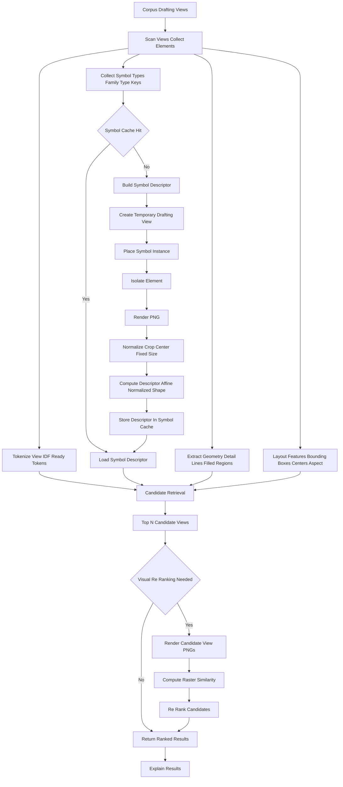

```mermaid
flowchart TD

A[Corpus Drafting Views] --> B[Scan Views Collect Elements]

B --> C[Tokenize View IDF Ready Tokens]
B --> D[Collect Symbol Types Family Type Keys]
B --> E[Extract Geometry Detail Lines Filled Regions]
B --> F[Layout Features Bounding Boxes Centers Aspect]

D --> G{Symbol Cache Hit}

G -->|Yes| H[Load Symbol Descriptor]

G -->|No| I[Build Symbol Descriptor]

I --> J[Create Temporary Drafting View]
J --> K[Place Symbol Instance]
K --> L[Isolate Element]
L --> M[Render PNG]
M --> N[Normalize Crop Center Fixed Size]
N --> O[Compute Descriptor Affine Normalized Shape]
O --> P[Store Descriptor In Symbol Cache]
P --> H

C --> Q[Candidate Retrieval]
H --> Q
E --> Q
F --> Q

Q --> R[Top N Candidate Views]

R --> S{Visual Re Ranking Needed}

S -->|No| T[Return Ranked Results]

S -->|Yes| U[Render Candidate View PNGs]
U --> V[Compute Raster Similarity]
V --> W[Re Rank Candidates]
W --> T

T --> X[Explain Results]
```
