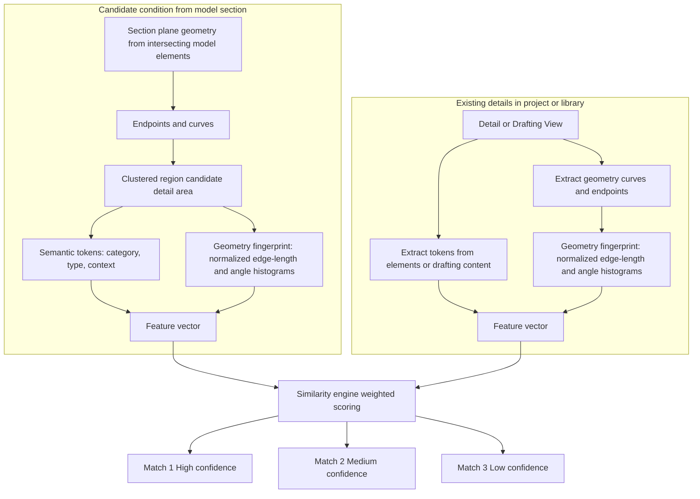

# How the System Recognizes Similar Details

## Notes

- The geometry fingerprint is designed to tolerate dimensional variation such as different wall thicknesses or small offsets by normalizing lengths and binning geometric relationships.
- Semantic tokens provide contextual signals derived from the elements or drafting content present in the detail, helping reduce false matches.
- The system produces ranked suggestions with confidence tiers rather than making automated drafting decisions.
